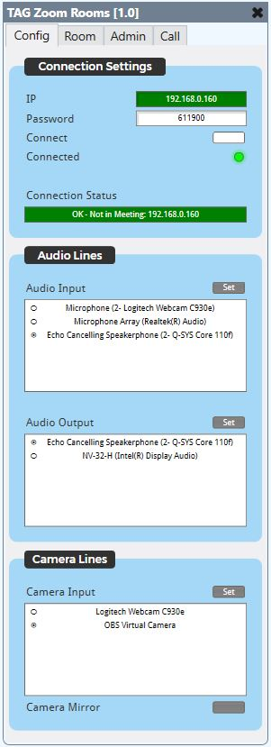
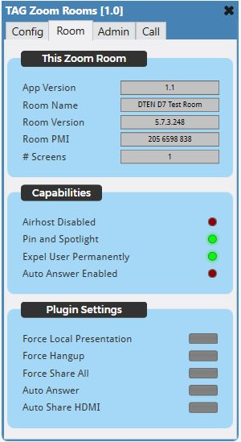
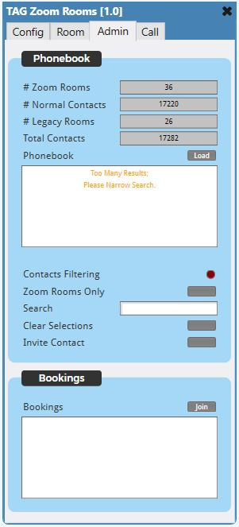

# TAG Zoom Rooms

This is a Q-SYS Plugin for the *Zoom Rooms Conferencing* software.

> Bug reports and feature requests should be sent to Jason Foord (jf@tag.com.au).

## How do I get set up?

See [Q-SYS Online Help File - Plugins](https://q-syshelp.qsc.com/#Schematic_Library/plugins.htm)

* In the Zoom Room Cloud under *Zoom Rooms -> Control System API* you must enable both the **Enable Control System API** setting and the **Allow SSH Connections** setting
* In the Zoom Room Cloud under *Zoom Rooms -> Control System API* you must set a **Passcode**. This will entered in the plugin under *Config -> Connection Settings -> Password*

## Notable features

* Massive phonebook support (tested with a phonebook over over 17000 contacts).
* Phonebook filtering (by Zoom Room) & contacts search field.
* Phonebook presence updates of displayed contacts.
> The ZR CLI can only have 500 contacts subscribed to presence updates at any one time. Contacts are subscribed after they have been filtered into the phonebook list box. It takes a moment for the presence updates to start updating, which is a limitation of the CLI.

## Tips

* Utlize QSC's 'On Screen Keyboard' from Asset Manager for input into the various text fields, such as:
	* Contact Search
	* Join ID
	* Join Password
* Use string matches to match states for read-only text fields such as:
	* Call Status
	* Sharing Status
	* Display State

## Properties

#### List Box Style

'Standard' or 'HTML5 Compatible'.

> HTML5 compatible mode is necessary due to rendering issues with list box icons. HTML5 compatible mode uses colors to highlight selected items instead of icons.

#### Highlight Color

The color of the selected items when in 'HTML5 Compatible' mode.

#### Debug Mode

> Basic | Verbose

#### Contacts Request Limit

The number of contacts to retrieve per request when fetching the phonebook.

> Zoom Rooms 5.11.x displayed issues with retrieving large collections of contacts. If the verbose debug shows an 'UNREADABLE DATA' when parsing the phonebook response, try lowering this limit.

## Controls

### Config Page

#### IP Address

The IP Address of the remote PC.

#### Password

The passcode configured in the Zoom Room Cloud under *Zoom Rooms -> Control System API*

#### Connect

Toggles the connection to the device.

#### Connected

Indicates if the SSH socket is connected.

#### Connection Status

Indicates the status of the connection.

> If the status is ***OK*** this control will show the meeting state and the IP address of the remote PC also.

#### Audio Input

A list box showing the available audio input devices.

> The active input shows as selected.

#### Set Audio Input

Sets the currently selected input as active.

#### Audio Output

A list box showing the available audio output devices.

> The active output shows as selected.

#### Set Audio Output

Sets the currently selected output as active.

#### Camera Input

A list box showing the available cameras.

> The active camera shows as selected.

#### Set Camera Input

Sets the currently selected camera active.

#### Camera Mirror

Mirrors the camera input.

### Room Page

#### App Version

The Zoom Room app version number.

#### Room Name

The Zoom Room name.

#### Room Version

The Zoom Room release version number.

#### Room PMI

The Zoom Room PMI.

#### Number of Screens

The number of screens detected.

#### Airhost Disabled

If Airhost is disabled for this Zoom Room.

#### Pin and Spotlight Enabled

If Pin and Spotlight is enabled for this Zoom Room.

#### Expel User Permanently

If Expelled users cannot rejoin the current meeting.

#### Auto Answer Enabled

If the auto-answer cloud setting is enabled for this Zoom Room.

#### Force Local Presentation

If the Zoom Room is not in a call, starts up local presentation mode.

#### Force Hangup

If the Zoom Room is in a call, hangs up.

#### Force Share All

If the "Share All" view is available, set it automatically.

> This view is only available when sharing in a multi-screen room.

#### Auto Answer

The ***Plugin*** automatically answers an incoming call.

> The *Cloud* auto-answer setting should be ***disabled*** for the plugin feature to work properly.

#### Auto Share HDMI

If the Zoom Room is in presentation mode, automatically start sharing the HDMI source.

### Admin Page

#### Number of Zoom Rooms

The number of Zoom Rooms in the phonebook.

#### Number of Normal Contacts

The number of Normal Contacts in the phonebook.

#### Number of Legacy Rooms

The number of Legacy Rooms in the phonebook.

#### Total Contacts

The total number of contacts.

#### Load Phonebook

Fetch the phonebook again.

#### Phonebook

Displays a list of contacts if the list is under a predetermind amount.

> The number of eligible contacts can be reduced using the search and filter controls.

#### Contacts Filtering

If filtering is currently being applied to the phonebook.

#### Zoom Rooms Only

Filters *out* contacts that are not a Zoom Room.

#### Search

Filters *out* contacts that do not match the search string.

> This search uses a ***string.find*** method. The string can match any part of the contact's screen name to produce a match.

#### Clear Selections

Unselects *all* contacts.

> Contacts that are selected but not currently displaying in the list box will also be cleared.

#### Invite Contact

Invites *all* selected contacts.

#### Bookings List

A list of upcoming bookings.

> Instant meetings are not display in this list.

#### Join Booking

Join the selected booking.

### Call Page

#### Call Status

The current call status.

> Not in Meeting | Connecting Meeting... | In Presentation Mode | In Meeting

#### Meeting ID

The current meeting ID.

#### Meeting Pass

The current meeting password.

#### Waiting for Host

If the current meeting is waiting for the host to join.

#### In Waiting Room

If the Zoom Room is in a waiting room.

> This is currently bugged, and returns false all the time.

#### In Call

If the Zoom Room is in a call.

#### Presentation Mode

If the Zoom Room is in local presentation mode.

#### Meeting is Being Recorded

If the current meeting is being recorded by anyone.

#### Start Presentation

If not in a call, starts local presentation mode.

#### Meet Now

If not in a call, starts an instant meeting.

> If in presentation mode, converts to an instant meeting.

#### Join ID

The ID of the meeting to join.

#### Meeting Requires Password

Flashes if attempting to join a meeting that returns a 'Meeting Requires Password" event.

#### Join Password

The password of the meeting to join.

#### Join Meeting

Attemps to join a meeting with the above credentials.

> If the password field is blank, the join command will be a 'join without password' command.

#### Caller Name

The screen name of the incoming caller.

#### Incoming Call

If there is an incoming call.

#### Accept Incoming Call

Accepts the incoming call.

#### Reject Incoming Call

Rejects the incoming call.

#### Mute on Entry State

If 'Mute on Entry' is enabled.

#### Enable Mute on Entry

Enables 'Mute on Entry'

#### Disable Mute on Entry

Disables 'Mute on Entry'

#### Call Lock State

If 'Call Lock' is enabled.

#### Enable Call Lock

Enables 'Call Lock'

#### Disable Call Lock

Disables 'Call Lock'

#### Mute My Microphone

Toggle this Zoom Room's microphone mute state.

#### Mute My Video

Toggle this Zoom Room's camera mute state.

#### Closed Captions Available

If closed captions are available.

#### Toggle Closed Captions

Toggles closed captions, if they are available.

#### Video is Optimizable

If video is optimizable.

#### Optimize Video

Optimizes the video.

#### Can Record

If the Zoom Room can record the meeting.

> Currently bugged - returns true even if it is in instant meeting. No email is associated with an instant meeting, and therefore the Zoom Room has no cloud location to send a recording.

#### Recording Disabled

If recording is disabled due to it being an instant meeting.

#### I am Recording

If this Zoom Room is currently recording.

#### Start Recording

Start recording this meeting.

#### Stop Recording

Stop recording this meeting.

#### Mute All

Mute all participants.

> Enables "Mute on Entry" automatically.

#### Unmute All

Unmute all participants.

> Disables "Mute on Entry" automatically.

#### Leave Meeting

Leave the current meeting.

#### End Meeting

End the current meeting.

#### Available Views

Show the available views that can be set.

#### Set View

Set the selected view.

#### Participants List

Show the current participants in the call.

#### Mute Participant Microphone

Controls the mute state of the selected participant.

#### Mute Participant Video

Controls the mute state of the selected participant.

#### Expel Participant

Expel the selected participant from the call.

> If the 'Expel User Permenantly' cloud setting is enabled, the user won't be able to rejoin this meeting unless the call is restarted.

#### Pin to Screen 1

Pin the selected participant to this screen.

#### Screen 1 Pin Status

Shows the participant that is currently pinned to this screen, or 'None'.

#### Pin to Screen 2

Pin the selected participant to this screen.

#### Screen 2 Pin Status

Shows the participant that is currently pinned to this screen, or 'None'.

#### Pin to Screen 3

Pin the selected participant to this screen.

#### Screen 3 Pin Status

Shows the participant that is currently pinned to this screen, or 'None'.

#### Pin to Screen 4

Pin the selected participant to this screen.

#### Screen 4 Pin Status

Shows the participant that is currently pinned to this screen, or 'None'.

#### Unpin

Unpin the selected participant from this screen.

#### Spotlight Active

Indicates whether a participant is currently being spotlighted.

#### Spotlighted Participant

Shows the screen name of the spotlighted participant, or 'None'.

#### Spotlight Participant

Spotlight the selected participant.

> Spotlighting only works if this Zoom Room is the host, and there are at least 3 participants in the meeting.

#### Remove Spotlight

Remove the spotlight.

#### Is Participant Recording

In Indicates if the selected participant has permission to record the call.

#### Allow Participant to Record

Give the selected participant permission to record the call.

#### Disable Participant from Recording

Revoke the selected participant's permission to record the call.

#### Participant is Recording

Indicates if the selected participant is recording the call.

#### Participant Camera List

Lists the cameras of the participants in the call.

> When in *Standard* list box mode, cameras that you do not have permission to control are *Red*.

>> A control request will be sent automatically when a participant's camera is selected *if* you currently do not have permission to control that participant's camera.

#### Request Control

Manually request control of a participant's camera.

#### Pan

Pan controls of the selected camera.

#### Tilt

Tilt controls of the selected camera.

#### Zoom

Zoom controls of the selected camera.

#### Sharing Status

The current sharing status.

> None | Connecting | Sending | Receiving | Send_Receiving

#### WiFi Name

If the Zoom Room uses a WiFi access point, then the name of that WiFi hot spot appears here.

> It will be blank if the Zoom Room has a wired connection.

#### Server Name

Name of the Zoom Room.

#### Password

The airplay password, for sharing your iOS device. It is not the sharing key or the meeting password.

#### Display State

The instructions the Zoom Room is displaying on the monitor.

> None | Laptop | IOS

#### Sharing Paused

If sharing is currently paused.

#### Instructions Visible

Indicates if any sharing instructions are on the screen.

#### Set Instructions None

Sets the specified sharing instructions on the monitor.

#### Set Instructions Laptop

Sets the specified sharing instructions on the monitor.

#### Set Instructions iOS

Sets the specified sharing instructions on the monitor.

#### Airplay Sharing

Indicates if an airplay device is sharing.

#### HDMI Connected

Indicates if a compatible HDMI capture device is connected via USB to the Zoom Room.

> Zoom support Magewell and INOGENI.

#### HDMI Data Available

Indicates if the user has connected an HDMI cable from a laptop to the HDMI capture card, and the HDMI capture card sees HDMI video coming from the Laptop.

#### HDMI Sharing

Whether HDMI is currently actively sharing.

#### Pairing Code

This is the paring code that is broadcast via an ultrasonic signal from the Zoom Room Controller. It is different than the user-supplied paring code.

> The ZRC uses a Zoom-proprietary method of advertizing the ultrasonic pairing code, so it's not possible to advertize it using commonly available libraries.

#### Sharing Key

The alpha-only sharing key that users type into a laptop client to share with the Zoom Room.

#### Direct Presentation Connected

Indicates if the laptop has connected to the Zoom Room, either via HDMI, or via network sharing.

#### Start Sharing HDMI

Start sharing the HDMI source.

#### Stop Sharing HDMI

Stop sharing the HDMI source.

#### Stop Local Sharing

Stops this Zoom Room from sharing.

#### Camera Name

If sharing, the id for the camera that is sharing.

#### Camera is Sharing

Whether the camera is currently being shared.

#### Can Control Camera

Whether it is possible to use the PTZ controls to control the camera.

#### Share Camera

Start sharing the camera.

#### Sharing Event Trigger

Triggers when a sharing event starts.

#### Host Ended Mode

Custom flag for the “Call Ended by Host” trigger event under *Call -> Zoom Events -> Host Ended*.

> Always Trigger: if the host ends the call, always fire this trigger.

> Auto-Answered Calls Only: if the host ends the call, only fire this trigger *if* the call was auto-answered by the plugin.

#### Host Ended Trigger

Triggers according to the "Host Ended Mode" setting.

#### Call Connected Trigger

Triggers when the "Call Connected' event is received.

#### Call Disconnected Trigger

Triggers when the "Call Disconnected' event is received.

#### Sharing Disabled Trigger

Triggers when an invalid screen sharing event occurs.

#### Auto Answered Trigger

Triggers when an the plugin auto answers the incoming call.